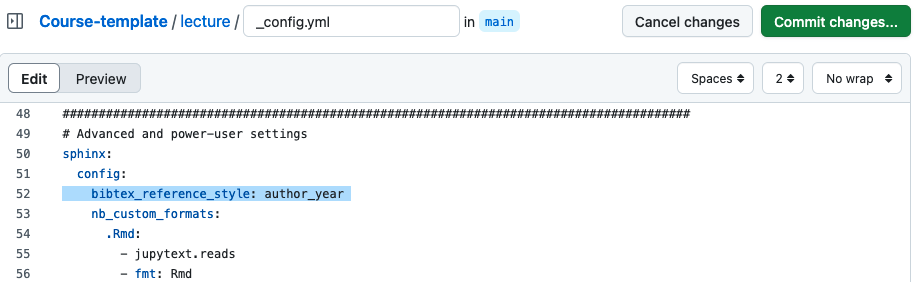

# Adding Citations and Bibliographies

If you want to include citations in your course website, you first need to create a BibTeX file to store the citation information. Then, you must edit the `_config.yml` file to ensure that the citations are displayed according to your preferences. 

## Create a Bibliography

Add a new file to your repository and use the `.bib` suffix to create a bibtex file.


Then, add your references to the file: 


## Edit the Config File
There are several inline style options available for your citations (see [here](https://sphinxcontrib-bibtex.readthedocs.io/en/latest/usage.html#referencing-style) for more details). We recommend adjusting the reference style in your `_config.yml` file by adding "bibtex_reference_style: author_year" right under "sphinx: config:". Please ensure the correct indentation.

This will ensure that author and year are displayed correctly.

## Add a Citation
Now, you can include your citations into your text. Here is an example:

```
{cite}`munafo2017manifesto`
```

Result:
{cite}`munafo2017manifesto`

## Add a Bibliography 

To add a bibliography, you need to use the `{footbibliography}` directive at the end of your page: 
````
```{bibliography}
```
````
At the end of this page, you will see an example bibliography.


## Next Section:
In the next section, you will learn how to integrate feedback questions.

----
**References**
```{bibliography} 
```

