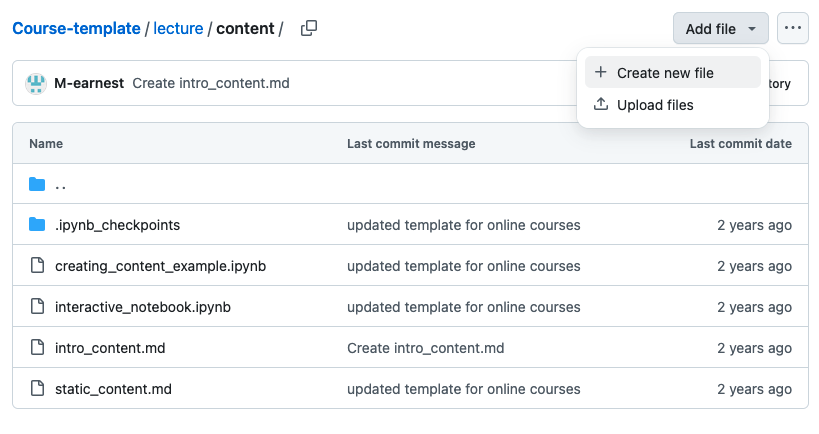

# Creating Engaging Content 

**Jupyter Book** allows for the integration of various markup languages and formats, including Markdown files, Jupyter notebooks, MyST Markdown notebooks, reStructured Text, and more. In this chapter, you will learn how to create content that is engaging to the user.

## Goals

This chapter aims to include the following goals.

1. Learn which types of files you can integrate into your Jupyter Book.
2. Learn how to create new files.
3. Learn how to format your text with Markdown.
4. Learn how to embed images, videos, and slides.
5. Learn how to include citations. 
6. Learn how to include feedback questions.
7. Learn how to set up your table of content.

## Different File Types 

In this tutorial, we will focus on using Markdown (.md) files, as Markdown is a powerful and easy-to-learn formatting language. It is ideal for primarily text-based content, as well as for embedding multimedia such as images and videos. If you want to include code and visualizations for scientific computing, we recommend using Jupyter Notebook (.ipynb) files.

Here’s an overview of both file types:
::::{grid}
:gutter: 2

:::{grid-item-card} .md (Markdown)
:class: dropdown
 `.md` files are Markdown files, which are primarily used for creating simple, easy-to-read documents. They use a simple syntax for formatting text and are often used for documentation, READMEs, and other types of text-based content. They are also commonly used in conjunction with version control systems like Git and can be easily rendered on various platforms.

 **.md files are best for documentation, READMEs, and other types of text-based content.**
 :::

:::{grid-item-card} .ipynb (Jupyter notebooks)
:class: dropdown
`.ipynb` files are Jupyter Notebook files and are primarily used for interactive data science and scientific computing. They allow for the combination of code, text, and visualizations all in one place, making it easy to document and share code-driven projects. They are often used by data scientists and researchers to share their work with others and can be easily converted to other formats like .html or .pdf for sharing.

**.ipynb files are best for interactive, code-driven projects.**
:::
::::

## Create a New File

To create a new file, click on "Add file" on the upper-right corner, then select "Create new file".

Next, give your file a name and specify the file type, such as /"introduction.md" to create a Markdown file.

Now, you can add your content to the file.

## Next Section:

In both .ipybn and .md files, Jupyter Book is able to parse MyST, a markup language that draws inspiration from RMarkdown. It allows for more advanced formatting options and the ability to include interactive elements, such as widgets and code snippets, within your content. 

In the next section, we present only a short overview of the features of MyST. However, there is much more documentation on [the MyST website.](https://myst-parser.readthedocs.io/en/latest/syntax/syntax.html#syntax-core)

